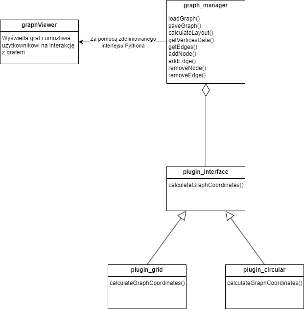
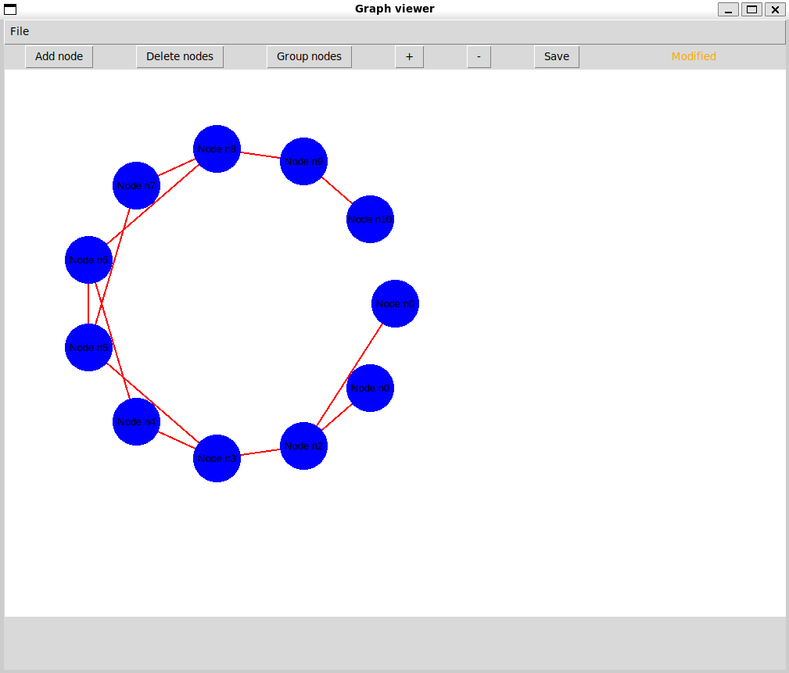
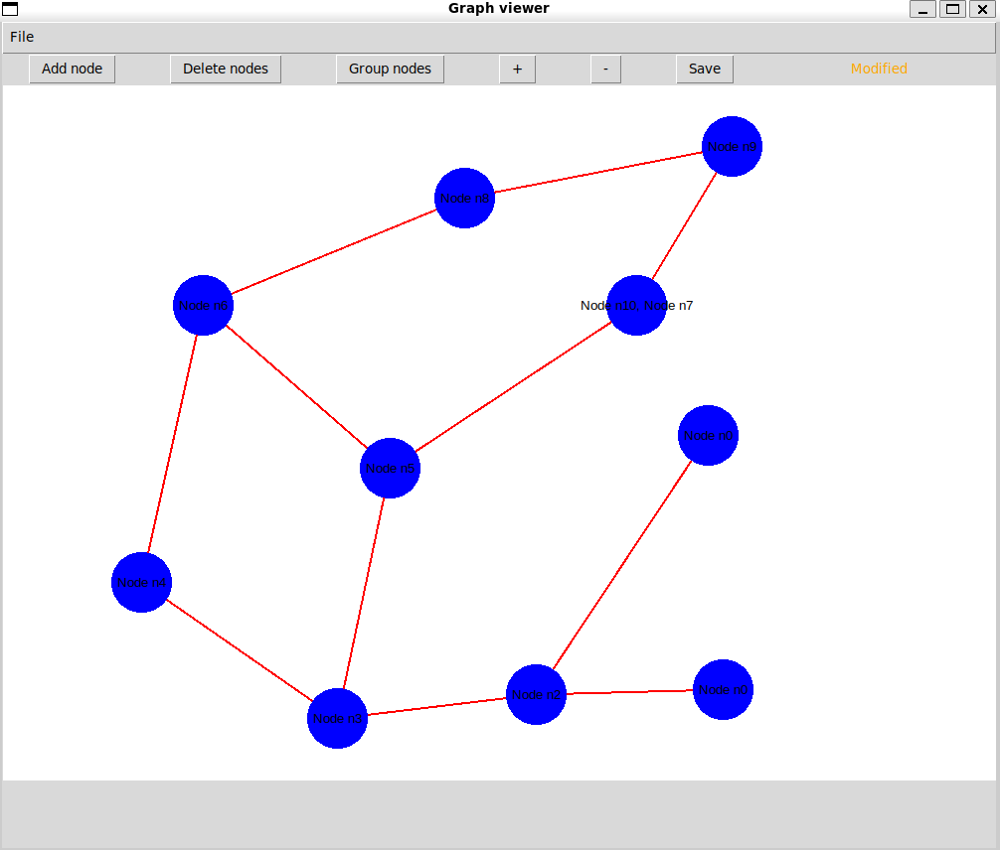
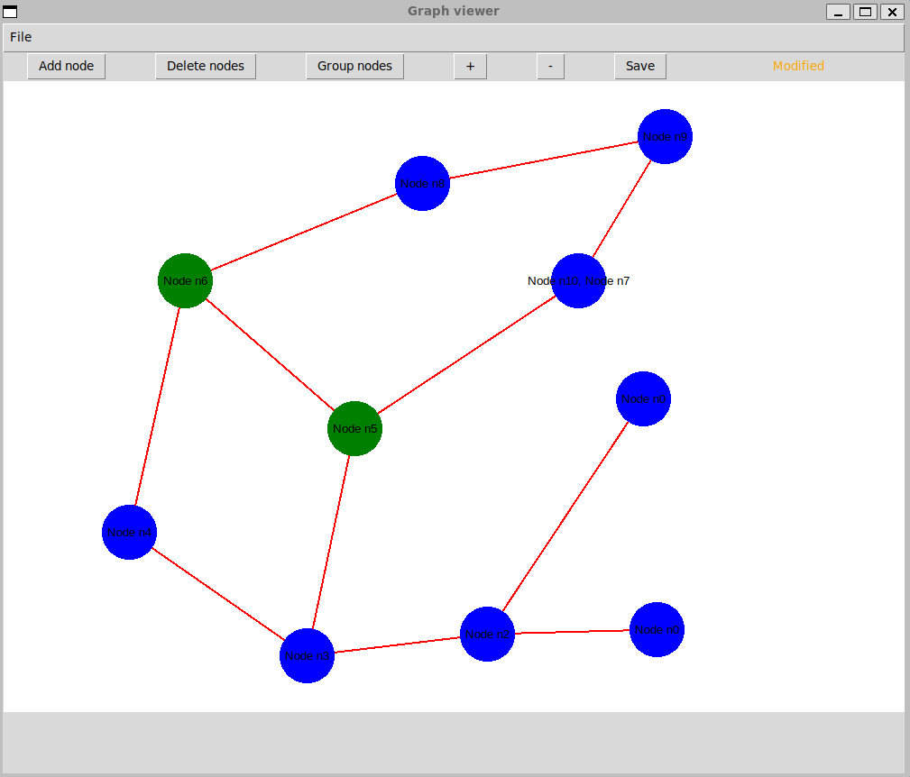

# Dokumentacja końcowa
## Narzędzie do wizualizacji grafów

### Rozwiązane podproblemy
- Aby zapewnić wydajność przetwarzania grafów, część za to odpowiedzialna została zaimplementowana w `C++`
- Zostało zdefiniowane API umożliwiające rozszerzenie aplikacji za pomocą wtyczek implementujących obsługę algorytmów rozłożenia
- Wtyczki są dynamicznie ładowanymi bibliotekami (Windows: *.dll*; Linux: *.so*)
- Przenośność kodu obsługi wtyczek została zapewniona przy pomocy biblioteki `Boost.DLL`
- Wizualizacja została zrealizowana w `Pythonie` ze względu na wygodę tworzenia aplikacji oraz brak wymagających obliczeń
- Rozszerzenie `Pythona` w `C++` zostało zrealizowane przy użyciu biblioteki `pybind11`

### Zaimplementowane funkcje (wszystkie jakie zaplanowano)
- Wczytywanie grafu w formacie `GraphML`
- Przybliżanie i oddalanie widoku grafu
- Grupowanie węzłów - węzły będą mogły być scalone w jeden, zawierający połączenia wszystkich wchłoniętych węzłów
- Ręczne przesuwanie węzłów
- Tworzenie, edytowanie oraz zapisywanie grafów
- Wyświetlanie informacji w węźle
- Dwie przykładowe wtyczki implementujące algorytmy rozłożenia grafu w przestrzeni

### Komentarz do zakresu wykonanych prac
Zaimplementowane zostały wszystkie z wstępnie zaplanowanych funkcjonalności, jednak nie został rozwiązany jeden podproblem - *zdefiniowanie API umożliwiającego rozszerzenie aplikacji za pomocą wtyczek implementujących obsługę dodatkowych formatów plików*. Problematyczne jest wczytywanie grafu, ponieważ trzeba założyć jakie dane (*properties*) mogą być przechowywane w wierzchołkach i krawędziach.

Na tę część zabrakło nam czasu, a doszliśmy do wniosku, że nie jest ona kluczowa dla naszej aplikacji. Dodatkowo wybrany przez nas format grafu jest jednym z popularniejszych. Ponadto przy implementacji tej części natrafiliśmy na problem, z którym nie udało nam się uporać.

Ze względu na ustawienie restrykcyjnych flag kompilacji, pojawił się problem z kompilacją w wersji *Release* części aplikacji napisanej w `C++` wynikający, jak przypuszczamy, z możliwego braku inicjacji zmiennej (iteratora krawędzi) w bibliotece `Boost`, nie znaleźliśmy sposobu, aby rozwiązać dany problem, więc przy kompilacji została ustawiona flaga `-Wno-uninitialized`.


### Struktura projektu



W części `C++` zostały napisane dwie wtyczki kompilowane jako biblioteki dynamiczne: *plugin_circular* i *plugin_grid*. Implementują one zdefiniowane API (*plugin_interface*) wyznaczając pozycje wierzchołków grafu za pomocą różnych algorytmów rozłożenia.

Wtyczki te są ładowane przez bibliotekę statyczną - *graphs_core* (powstałą poprzez kompilacje *GraphManager*), podczas działania programu. Umożliwia ona wczytanie i zapisanie grafu do pliku oraz edycję grafu.

Funkcjonalności tej biblioteki są udostępniane `Pythonowej` części dzięki kompilacji jako moduł `Pythonowy` ze zdefiniowanymi bindingami przy użyciu `pybind11`.

Część `Pythonowa` składa się jedynie z klasy *GraphViewer* która odpowiedzialna jest za graficzną prezentację grafów obsługiwanych za pomocą biblioteki *graphs_core*.

### Instrukcja
W folderze głównym w pliku *Makefile* zostały zdefiniowane komendy umożliwiające szybkie zarządzanie projektem.

#### Kompilacja części `C++`
- tryb *Release*
    ```
    make compile
    ```
- tryb *Debug*
    ```
    make compile_debug
    ```

#### Instalacja potrzebnych bibliotek dla części `Python`
```
make py_setup
```

#### Uruchomienie aplikacji
```
make run
```

#### Generowanie dokumentacji
```
make doxy
```

#### Uruchomienie testów jednostkowych
```
make compile_debug
make test
```

#### Formatowanie kodu `C++` (za pomocą *clang-format*)
```
make format_cpp
```

#### Formatowanie kodu `Python` (za pomocą *black*)
```
make format_py
```

#### Statyczna analiza kodu `Python` (za pomocą *flake8*)
```
make lint_py
```

#### Statyczna analiza kodu kodu `C++` (za pomocą *clang-tidy*)
Została ona zintegrowana z procesem kompilacji za pomocą CMake'a.


### Prezentacja
#### Załadowany graf



#### Modyfikacja grafu
- Ręczne przesuwanie wierzchołków
- Grupowanie wierzchołków
- Przybliżanie



#### Zaznaczenie wierzchołków




### Testy
- 34 testy jednostkowe części `C++`


- Część GUI w `Pythonie` była testowana ręcznie